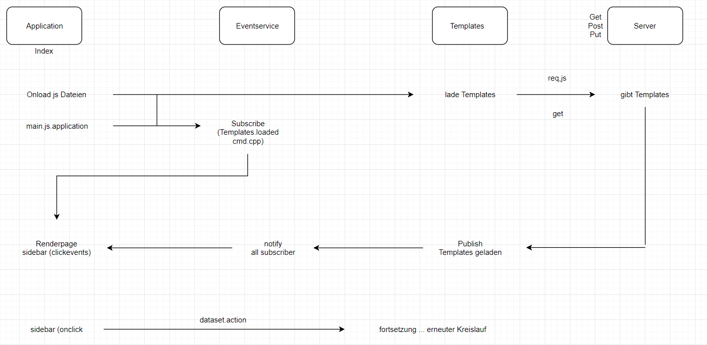
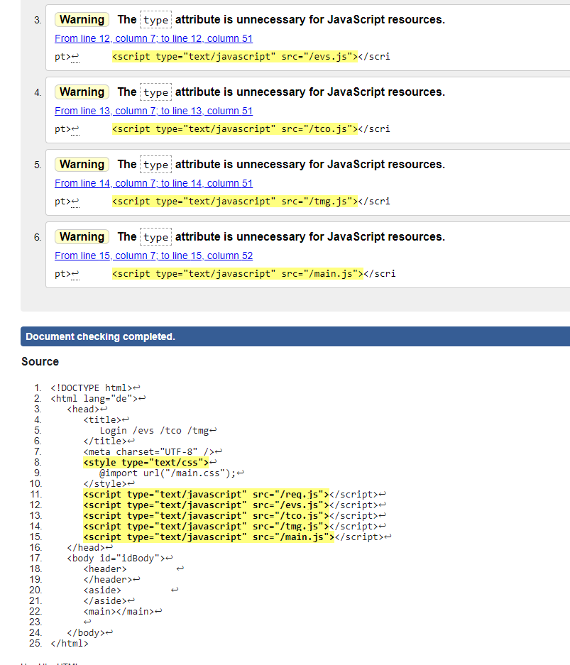
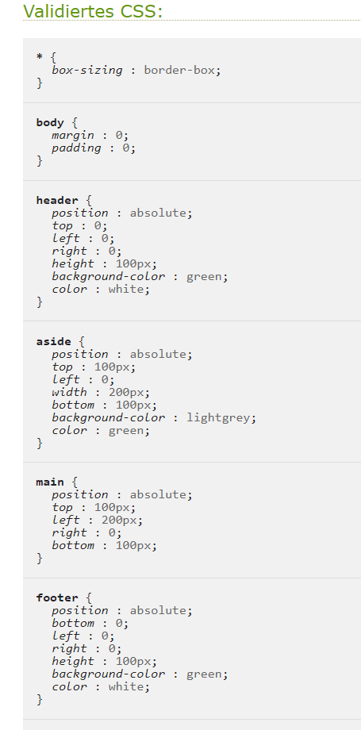

**WEB Praktikum**

**Termin 3**  

**Von _Marvin Waligora_ und _Dennis Halter_ - Gruppe _C_ zum 22.01.2019**

# 1. Einleitung:

## Aufgabe der Anwendung
- Die Aufgabe der entwickelten Anwendung "Bug-Tracker" ist es Fehler in Projekten zu erkennen und zu beseitigen. Ein Mitarbeiter der Qualitätssicherung (QS) ist in der Lage Fehler zu erkenne und zu Protokollieren. Im weiteren Verlauf der Fehleranalyse kann der Fehler von einem Softwareentwickler (SW) bearbeitet und fertiggestellt werden. Der "Bug-Tracker" ist als Client/Server Anwendung mit dem REST Archtiekturprinzip realisiert. Um in die jeweilige Rolle des Mitarbeiter zu schlüpfen müssen sich die Mitarbeiter vor jeder Benutzung vom "Bug-Tracker" anmelden.

### Zustandsdiagramm

## Berücksichtigter Funktionsumfang
 - Anmeldung als QS-Mitarbeiter oder Softwareentickler
    - Rolle QS: Protokollieren von Fehlern
    - Rolle SW: Bearbeiten von Fehlern
- Protokollieren von Fehlern
    - Beschreibung des Fehlers
    - QS-Mitarbeiter der Fehler erfasst hat
    - das Datum der Erfassung
    - die fehlerhafte Komponente
    - Kategorie des Fehlers (Fehler/Ursache)
- Bearbeiten von Fehlern
    - der Bearbeitende Softwareentwickler wird angegeben
    - das Datum der Beseitigung erfasst
    - die Ursache des Fehlers wird einer Kategorie zugeordnet
- Pflege von Kategorien
    - Einteilung nach Fehlerkategorie und Fehlerursache
- Pflege von Komponenten
    - Komponenten mit zugehörigkeit eines Projekts anlegen, löschen und ändern
- Auswertung von Fehlerdaten
    - nach Projekt/Komponente/Status
    - nach Projekt/Komponente/Status/Zeitdifferenz             
    - nach Kategorie/Status

# 2. Implementierung des Servers:

## REST-Interface
- Hier arbeiten wir mit dem REST-Interface. Dieser arbeitet Zustandslos mit einer Einheitlichen Schnittstelle. Einzelne Schichten können jeweils nur die direkt angrenzende Schicht sehen. Hauptsächlich arbeiten wir mit den folgenden Methoden:
    - GET - fordert Daten vom Server an
    - POST - übermittelt Daten an den Server
    - PUT - ändert bestehende Daten auf dem Server
    - DELETE - löscht bestehende Daten auf dem Server

## Beschreibung des Servers
- Login
    - GET/login
        - curl http://localhost:8080/login
    - POST/login/+Daten
        - curl --request POST --data "Name=AdminSW&Passwort=AdminSW" http://localhost:8080/login/

- Logout
    - GET/login/"logout"
        - curl http://localhost:8080/login/"logout"

- Projekt
    - GET /projekt/
        - curl http://localhost:8080/projekt
    - GET /projekt/:projekt-id
        - curl http://localhost:8080/projekt/60
    - POST /projekt/ + Daten
        - curl --request POST --data "id=61&Name=qwerty" http://localhost:8080/projekt/
    - PUT /projekt/:id + Daten
        - curl --request PUT --data "id=52&Name=xyz" http://localhost:8080/projekt/
    - DELETE /projekt/:id
        - curl --request DELETE http://localhost:8080/projekt/63

- Komponenten
    - GET /projektkomponenten/:projekt-id
        - curl http://localhost:8080/projektkomponenten
    - GET /komponente/
        - curl http://localhost:8080/komponente
    - GET /komponente/:komponente-id
        - curl http://localhost:8080/komponente/1
    - POST /komponente/:projekt-id + Daten
        - curl --request POST --data "id=2&Projekt=aaaaaaaaaaaaaa1212&Komponente=1234"                     http://localhost:8080/komponente/
    - PUT /komponente/:komponente-id + Daten
        - curl --request PUT --data "id=1&Projekt=aaaaaaaaaaaaaa1212&Komponente=1234"  http://localhost:8080/komponente/
    - DELETE /komponente/:komponente-id
        - curl --request DELETE http://localhost:8080/komponente/17

- MitarbeiterQS
    - GET /qsmitarbeiter/
        - curl http://localhost:8080/qsmitarbeiter
    - GET /qsmitarbeiter/:qsmitarbeiter-id
        - curl http://localhost:8080/qsmitarbeiter/9
    - POST /qsmitarbeiter/ + Daten
        - curl --request POST --data "id=11&Name=cdef&Vorname=123456&Abteilung=QS" http://localhost:8080/qsmitarbeiter/
    - PUT /qsmitarbeiter/:qsmitarbeiter-id + Daten
        - curl --request PUT --data "id=9&Name=cd&Vorname=1234&Abteilung=QS" http://localhost:8080/qsmitarbeiter/
    - DELETE /qsmitarbeiter/:qsmitarbeiter-id
        - curl --request DELETE http://localhost:8080/qsmitarbeiter/21

- Swentwickler
    - GET /swentwickler/
        - curl http://localhost:8080/swentwickler
    - GET /swentwickler/:swentwickler-id
        - curl http://localhost:8080/swentwickler/24
    - POST /swentwickler/ + Daten
        - curl --request POST --data "id=25&Name=cdef&Vorname=123456&Abteilung=SW" http://localhost:8080/swentwickler/
    - PUT /swentwickler/:swentwickler-id + Daten
        - curl --request PUT --data "id=24&Name=cd&Vorname=1234&Abteilung=SW" http://localhost:8080/swentwickler/
    - DELETE /swentwickler/:swentwickler-id
        - curl --request DELETE http://localhost:8080/swentwickler/25

- KategorieFehler
    - GET /katfehler/
        - curl http://localhost:8080/katfehler
    - GET /katfehler/:katfehler-id
        - curl http://localhost:8080/katfehler/17
    - POST /katfehler/ + Daten
        - curl --request POST --data "id=11&Beschreibung=cdef&src=ab" http://localhost:8080/katfehler/
    - PUT /katfehler/:katfehler-id + Daten
        - curl --request PUT --data "id=17&Beschreibung=1234&src=ab" http://localhost:8080/katfehler/
    - DELETE /katfehler/:katfehler-id
        - curl --request DELETE http://localhost:8080/katfehler/28

- KategorieUrsache
    - GET /katursache/
        - curl http://localhost:8080/katursache
    - GET /katursache/:katursache-id
        - curl http://localhost:8080/katursache/22
    - POST /katursache/ + Daten
        - curl --request POST --data "id=24&Beschreibung=cdefgh&src=abcd" http://localhost:8080/katursache/
    - PUT /katursache/:katursache-id + Daten
        - curl --request PUT --data "id=22&Beschreibung=1234&src=ab" http://localhost:8080/katursache/
    - DELETE /katursache/:katursache-id
        - curl --request DELETE http://localhost:8080/katursache/27

- Fehler
    - GET /fehler/
        - curl http://localhost:8080/fehler
    - GET /fehler/?type=erkannt
        - curl http://localhost:8080/fehler/"type=erkannt"
    - GET /fehler/?type=behoben
        - curl http://localhost:8080/fehler/"type=behoben"
    - GET /fehler/:fehler-id
        - curl http://localhost:8080/fehler/33
    - POST /fehler/ + Daten
        - curl --request POST --data "id=37&Beschreibung=1234&Mitarbeiter=ab&Datum=sdas&Komponente=werter&Projekt=qwert&FehlerKategorie=qweqwe&Status=behoben&BeschreibungFehlerUrsache=asdfg&MitarbeiterDerFehlerBehobenHat=yxccv&DatumDerBeseitigung=lkjhg&KategorieFehlerUrsache=mnbv" http://localhost:8080/fehler/
    - PUT /fehler/:fehler-id + Daten
        - curl --request PUT --data "id=33&Beschreibung=1234&Mitarbeiter=ab&Datum=sdas&Komponente=werter&Projekt=qwert&FehlerKategorie=qweqwe&Status=behoben&BeschreibungFehlerUrsache=asdfg&MitarbeiterDerFehlerBehobenHat=yxccv&DatumDerBeseitigung=lkjhg&KategorieFehlerUrsache=mnbv" http://localhost:8080/fehler/
    - PUT /fehler/?type=behoben&Zustand=erfolgreich
        - curl --request PUT --data "id=33&Beschreibung=""&Mitarbeiter=""&Datum=""&Komponente=""&Projekt=""&FehlerKategorie=""&Status=erkannt&BeschreibungFehlerUrsache=""&MitarbeiterDerFehlerBehobenHat=""&DatumDerBeseitigung=""&KategorieFehlerUrsache=""&Zustand=erfolgreich"
        http://localhost:8080/fehler/
    - PUT /fehler/?type=behoben&Zustand=fehlgeschlagen
        - curl --request PUT --data "id=33&Beschreibung=""&Mitarbeiter=""&Datum=""&Komponente=""&Projekt=""&FehlerKategorie=""&Status=erkannt&BeschreibungFehlerUrsache=""&MitarbeiterDerFehlerBehobenHat=""&DatumDerBeseitigung=""&KategorieFehlerUrsache=""&Zustand=fehlgeschlagen"
        http://localhost:8080/fehler/

- Auswertung Projekte
    - GET /prolist/
        - curl http://localhost:8080/prolist

- Auswertung Kategorien
    - GET /katlist/
        - curl http://localhost:8080/katlist

- Templates
    - GET /templates/
        - curl http://localhost:8080/templates

# 3. Module

## Bestandteile der Module
### Python    
- Application.py
    - Hier werden die Module für die Applikation bereitgestellt
        - Login_cl
            - Verwaltet das An und Abmelden von Mitarbeitern
        - Application_cl
            - Stellt Funktionalität für die Listen und detailsicht zur Verfügung
        - Projects_cl
            - Verwaltet das erzeugen, bearbeiten und löschen von Projekten
        - Komponente_cl
            - Verwaltet das erzeugen, bearbeiten und löschen von komponenten
        - ProjektKomponenten_cl
            - Liste mit Verfügbaren Projekten
        - Mitarbeiter_cl
            - Liste von aller Mitarbeiter wird angezeigt
        - MitarbeiterSW_cl
            - Verwaltet das erzeugen, bearbeiten und löschen von Fehler SW-Mittarbeitern
        - MitarbeiterQS_cl
            - Verwaltet das erzeugen, bearbeiten und löschen von QS-Mitarbeitern
        - Categories_cl
            - Liste von aller Kategorien
        - KategorieFehler_cl
            - Verwaltet das erzeugen, bearbeiten und löschen von Fehlerkategorien
        - KategorieUrsache_cl
            - Verwaltet das erzeugen, bearbeiten und löschen von Ursachenkategorien
        - FehlerErkannt_cl
            - Verwaltet das erzeugen, bearbeiten und löschen von Fehlern
        - AuswertungPro_cl
            - Fehler nach Projekt sortiert
        - AuswertungKat_cl
            - Fehler nach Kategorie sortiert

### Öffentliche Methoden
### Python
- Login_cl
    - GET(self, id)
    - POST(self, data_opl)
- Application_cl   
- Projects_cl
    - GET(self, id)
    - POST(self, data_opl)
    - PUT(self, data_opl)
    - DELETE(self, id)
- Komponente_cl
    - GET(self, id)
    - POST(self, data_opl)
    - PUT(self, data_opl)
    - DELETE(self, id)
- ProjektKomponenten_cl
    - GET(self, id)
- Mitarbeiter_cl
    - GET(self, id)
- MitarbeiterSW_cl
    - GET(self, id)
    - POST(self, data_opl)
    - PUT(self, data_opl)
    - DELETE(self, id)
- MitarbeiterQS_cl
    - GET(self, id)
    - POST(self, data_opl)
    - PUT(self, data_opl)
    - DELETE(self, id)
- Kategorie_cl
    - GET(self, id)
- KategorieFehler_cl
    - GET(self, id)
    - POST(self, data_opl)
    - PUT(self, data_opl)
    - DELETE(self, id)
- KategorieUrsache_cl
    - GET(self, id)
    - POST(self, data_opl)
    - PUT(self, data_opl)
    - DELETE(self, id)
- FehlerErkannt_cl
    - GET(self, id)
    - POST(self, data_opl)
    - PUT(self, data_opl)
    - DELETE(self, id)
- AuswertungPro_cl
    - GET(self, id)
- AuswertungKat_cl
    - GET(self, id)

## Zusammenwirken der Komponenten
### Python    
- Login_cl(object):
    - Liest Logindaten aus Datenbank
    - Übergibt Logindaten an Datenbank zum An und Abmelden eines Nutzers
- Projects_cl(object):
    - Erhält Projektdaten vom Client
    - Liest Projektdaten aus Datenbank
    - Übergibt Projektdaten an Datenbank zum Erzeugen, Löschen und Aktualisieren
- Komponente_cl(object):
    - Erhält Komponentendaten vom Client
    - Liest Komponentendaten aus Datenbank
    - Übergibt Komponentendaten an Datenbank zum Erzeugen, Löschen und Aktualisieren
- ProjektKomponenten_cl(object):
    - Erhält ProjektKomponentendaten vom Client                
    - Übergibt ProjektKomponentendaten an Datenbank zum Filtern nach Projekten
- Mitarbeiter_cl(object):
    - Erhält sämtliche Mitarbeiterdaten aus Datenbank um Liste von Mitarbeitern anzuzeigen     
- MitarbeiterSW_cl(object):
    - Erhält MitarbeiterSWdaten vom Client
    - Liest mitarbeiterSWdaten aus Datenbank zum Erzeugen, Löschen und Aktualisieren
- MitarbeiterQS_cl(object):
    - Erhält MitarbeiterQSdaten vom Client
    - Liest mitarbeiterQSdaten aus Datenbank zum Erzeugen, Löschen und Aktualisieren
- Kategorie_cl(object):
    - Erhält Kategoriedaten um Liste zu laden
- KategorieFehler_cl(object):
    - Erhält KategorieFehlerdaten von Client
    - Liest KategorieFehlerdaten aus Datenbank zum Erzeugen, Löschen und Aktualisieren
- KategorieUrsache_cl(object):
    - Erhält KategorieUrsachedaten vom Client
    - Liest KategorieUrsachedaten aus Datenbank zum Erzeugen, Löschen und Aktualisieren
- FehlerErkannt_cl(object):
    - Erhält Fehlerdaten vom Client
    - Liest Fehlerdaten aus zum Erzeugen, Löschen und Aktualisieren
- AuswertungPro_cl(object):
    - Erhält gefilterte Fehlerdaten nach Projekt
- AuswertungProZeit_cl(object):
    - Gefilterte Fehlerdaten nach Projekt, Komponente und Zeitdifferenz
- AuswertungKat_cl(object):
    - Erhält gefilterte Fehlerdaten nach Kategorie

## Database.py
### Python
- Hier werden die Verwaltung von folgenden Daten geregelt
    - fehler
    - katfehler
    - katursache
    - komponente
    - projekt
    - mitarbeiter
    - qsmitarbeiter
    - swentwickler
- Klassen
    - Database_cl    

### Öffentliche Methoden
- Database_cl
    - readData(self, file_name):
    - saveData(self, file_name, data):
    - GetMaxID(self, file_name):
    - UpdateMaxID(self, file_name):
    - ReadProjectData(self):
    - AddProject(self, data):
    - GetProjectMaxId(self):
    - UpdateProject(self, id_s, data):
    - DeleteProject(self, id_s):
    - GetProjectData(self, id_s):
    - GetDefaultProjectData(self):
    - ReadComponentData(self):
    - AddComponent(self, data):
    - GetComponentMaxId(self):
    - UpdateComponent(self, id_s, data):
    - DeleteComponent(self, id_s):
    - GetComponentData(self, id_s):
    - GetDefaultComponentData(self):
    - ReadEmployeeSWData(self):
    - AddEmployeeSW(self, data):
    - GetEmployeeSWMaxId(self):
    - UpdateEmployeeSW (self, id_s, data):
    - DeleteEmployeeSW(self, id_s):
    - GetEmployeeSWData(self, id_s):
    - GetDefaultEmployeeSWData(self):
    - ReadEmployeeQSData(self):
    - AddEmployeeQS(self, data):
    - GetEmployeeQSMaxId(self):
    - UpdateEmployeeQS (self, id_s, data):
    - DeleteEmployeeQS(self, id_s):
    - GetEmployeeQSData(self, id_s):
    - GetDefaultEmployeeQSData(self):
    - ReadCatErrorData(self):
    - AddCatError(self, data):
    - GetCatErrorMaxId(self):
    - UpdateCatError (self, id_s, data):
    - DeleteCatError(self, id_s):
    - GetCatErrorData(self, id_s):
    - GetDefaultCatErrorData(self):
    - ReadCatCauseData(self):
    - AddCatCause(self, data):
    - GetCatCauseMaxId(self):
    - UpdateCatCause (self, id_s, data):
    - DeleteCatCause(self, id_s):
    - GetCatCauseData(self, id_s):
    - GetDefaultCatCauseData(self):
    - ReadErrorData(self):
    - AddError(self, data):
    - GetErrorMaxId(self):
    - UpdateError (self, id_s, data):
    - DeleteError(self, id_s):
    - GetErrorData(self, id_s):
    - GetDefaultErrorData(self):

### Zusammenwirken
- Fehler
    - QS Mitarbeiter kann Fehler erkennen
    - Fehler wird in JSON datei angelegt
    - Fehler kann von SWEntwicker behoben werden
- Kategorie
    - Auflistung der vorhandenen Kategorien
- Katfehler
    - Es können fehler pro Kategorie angelegt, bearbeitet und gelöscht werden                
- Katursache
    - Es können Ursachen pro Kategorie angelegt, bearbeitet und gelöscht werden
- Projektkomponente
    - liefert komponenten nach zugeordnetem Projekt
- Komponente
    - Komponenten können Angelegt, bearbeitet und gelöscht werden
    - Sind im JSON Format hinterlegt
    - Sind einem Projekt zugeordnet
- Projekt
    - Projekte können Angelegt, bearbeitet und gelöscht werden
    - Sind im JSON Format hinterlegt
- Mitarbeiter
    - Liste aller Mitarbeiter
- Qsmitarbeiter
    - QS-Mitarbeiter können Angelegt, bearbeitet und gelöscht werden
    - Sind im JSON Format hinterlegt
- Swentwickler
    - SW-Entwickler können Angelegt, bearbeitet und gelöscht werden
    - Sind im JSON Format hinterlegt

# 4. Client

## Klassen
- Application_cl()
- ListView_cl()        
- DetailView_cl()
- Sidebar_cl()

## Eventservice
- Mit hilfe des Eventscervices ist es möglich Nachrichten zu versenden ohne einen wirklichen Empfänger zu kennen. Die Implementierung des Eventservices realisiert das publish subscriber Muster. Subscriber melden sich zum Empfang von Nachrichten an, die publisher veröffentlichen die Nachricht. Anschließend werden die Subscriber über ihre Notify Schnittstelle benachrichtigt. Zuletzt beenden die Subscriber den Empfang der Nachrichten.

## TemplateVerarbeitung
- Templates werden in zwei Varianten verarbeitet. Als Liste sowie als Detail. Alle Daten in Listentemplates über die ID kann dann auf die spezielle Datailansicht verwiesen werden.
Im Bug-Tracker werden folgende Templates verwendet:
    - sidebar.tpl.html
    - Anmeldung.tpl.html
    - ProjektForm.tpl.html
    - Komponenten.tpl.html
    - KomponenteForm.tpl.html
    - Mitarbeiter.tpl.html
    - MitarbeiterSW.tpl.html
    - MitarbeiterSWForm.tpl.html
    - MitarbeiterQS.tpl.html
    - MitarbeiterQSForm.tpl.html
    - Kategorien.tpl.html
    - KatFehler.tpl.html
    - KatFehlerForm.tpl.html
    - KatUrsache.tpl.html
    - KatUrsacheForm.tpl.html
    - Fehler.tpl.html
    - ErkannteFehler.tpl.html
    - ErkannteFehlerForm.tpl.html
    - ErkannteFehlerBearbeitenForm.tpl.html
    - BehobenFehler.tpl.html
    - AuswertungKategorie.tpl.html
    - AuswertungProjekte.tpl.html
    - AuswertungProjekteZeit.tpl.html

# Validierung

Bei der Validierung wurden letzte Fehler behoben und bei der letzten Validierung kam es zu keinem Fehler.

